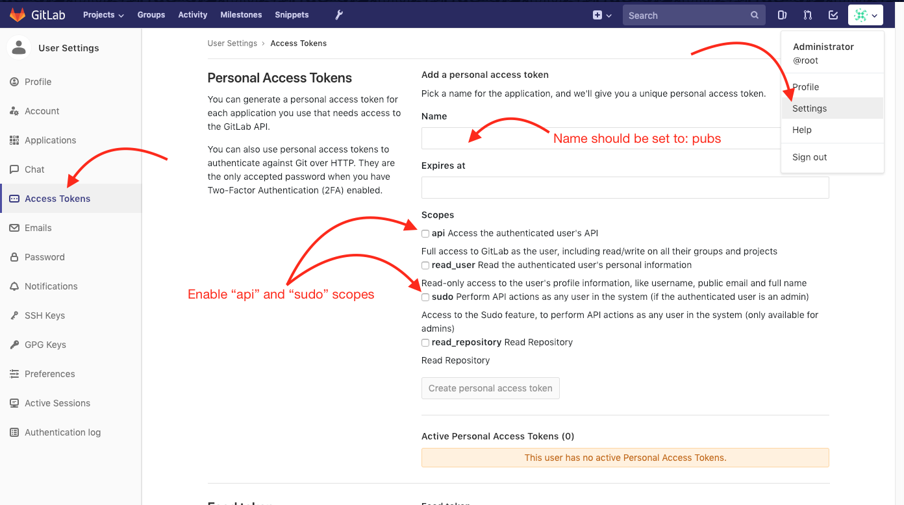
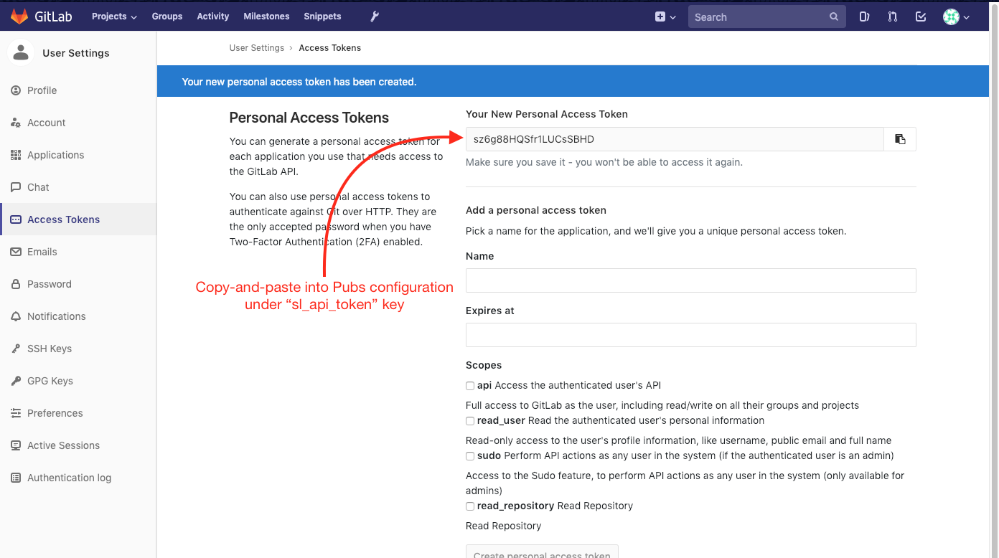
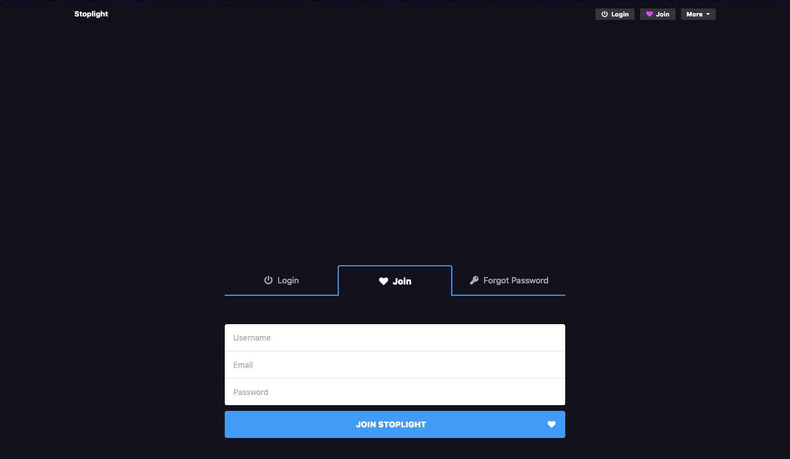

<p align="center">
  
  <h1>Stoplight</h1>
</p>

## Getting Setup

The guide below covers setting up the [Stoplight platform](https://next.stoplight.io) in a local/test environment using the `docker-compose` tool. This guide assumes you already are familiar with Docker and have been provided access to the Stoplight Docker registry by the Stoplight Support team.

> If deploying Stoplight on a remote instance (for example within an AWS VPC), be sure to review the `docker-compose.yml` file and update the URL/hostnames according to your environment.

### Logging into the Docker Container Registry

The first thing you'll need to do is to login to the Stoplight container registry. You should have been provided credentials by Stoplight as part of your agreement with us.

> If you do not have credentials, please send us an email at customers@stoplight.io

To login to the container registry, run the command:

```bash
DOCKER_USERNAME="myuser"
DOCKER_PASSWORD="mypassword"
docker login -u="$DOCKER_USERNAME" -p="$DOCKER_PASSWORD" quay.io
```

Once you have authenticated with the Stoplight container registry, make sure and pull the latest stable release of the "hub-builder" image before starting the Stoplight platform - the others will be pulled by Docker at run time.

You can do this with the command:

```bash
docker pull quay.io/stoplight/hub-builder:4.7.5
```

#### A Note About DNS

> Note this section only applies if you are bringing up Stoplight locally (accessing it and running it on the same machine) - otherwise skip ahead

Due to the way the Stoplight components communicate, you will need to update your local DNS settings in order for your browser and the running Docker containers to be able to communicate with the same hostnames.

If running on macOS or Linux, the easiest way to do add the following line to your `/etc/hosts` file:

```
127.0.0.1   app.stoplight.local api.stoplight.local prism.stoplight.local gitlab.stoplight.local pubs.stoplight.local tasker.stoplight.local
```

> Editing the `/etc/hosts` file can only be done with administrative access (ie, `sudo`)

You can accomplish the same goals with a custom DNS server (or something like [dnsmasq](http://www.thekelleys.org.uk/dnsmasq/doc.html)), however that is outside the scope of this document.

### Starting Stoplight

To bring up the Stoplight platform, from the root of this repository run the command:

```
docker-compose up -d
```

> Note that the `-d` argument sends the containers into the background. To see the status of containers in the background, run either `docker-compose ps` or `docker-compose logs --tail=10 -f`.

### Configuring Pubs

Pubs requires a GitLab admin API token in order to know which project to publish
documentation under.

Once GitLab is up, login as the root user (or any other
administrative user) and navigate to the user settings page as shown below:



Create an API key called 'pubs' with both `api` and `sudo` scopes.



Once the API key is generated, set it in the `config/pubs.yml` configuration
file under the key: `sl_api_token`

```yaml
# Token/JWT for authenticating reqeusts to the api.
sl_api_token: "sz6g88HQSfr1LUCsSBHD"
```

Once set, either restart or start the Pubs service with:

```bash
# if already running
docker-compose restart pubs

# if not running
docker-compose up -d pubs
```

### Logging into Stoplight

If everything worked, then navigating to the app URL (which defaults to http://app.stoplight.local:3100, but may vary depending on your setup) should bring up the typical Stoplight login screen:



If you run into any errors, be sure to check the container log output with `docker-compose logs` to see what might have gone wrong.

## Troubleshooting

If you run into issues at any time, please don't hesitate to contact us directly at customers@stoplight.io for assistance.

> Be sure to include as much information as you can (host OS, the docker-compose file, any relevant logs, etc) when opening tickets.
